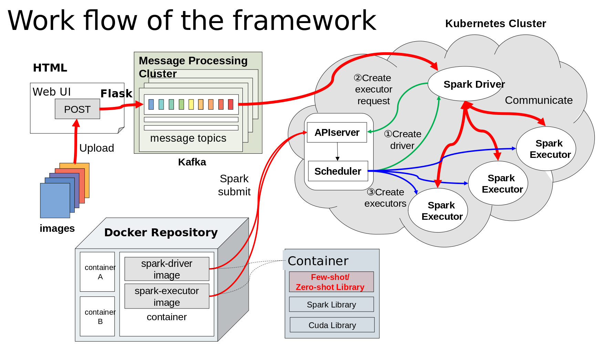

### Please watch the [slides](https://github.com/Natureal/Distribution_intern/blob/master/CHEN_PENG_Hitachi_Presentation.pptx) if you're interested: 



### Document records

- written during the internship in Hitachi Central Laboratory

- Doc List

  - [Docker Docs](https://github.com/Natureal/Distribution_intern/blob/master/Docker_docs.md)
  - [Kubernetes Docs](https://github.com/Natureal/Distribution_intern/blob/master/kubernetes_docs.md)
  - [Hadoop & Spark](https://github.com/Natureal/Distribution_intern/blob/master/hadoop_spark_docs.md)
  - [File Tree](https://github.com/Natureal/Distribution_intern/blob/master/file_tree_docs.md)
  - [Project1 Spark on K8S](https://github.com/Natureal/Distribution_intern/blob/master/Proj1_spark_on_k8s_docs.md)
  - [Project1 Steps](https://github.com/Natureal/Distribution_intern/blob/master/Proj1_steps_docs.md)

---

### Problems in using Docker

**I. Building Docker Private Repository** ======================================

Motivation: 镜像除了从 dockerhub 中 pull，还可以自己搭建私有库，以提供自定义的镜像供分布式系统中不同 Node 使用。

1. Pull image "registry" from dockerhub

```
sudo docker pull registry
```

2. Run the private repository persistently on the port 6001

```
sudo docker run -d -p 6001:5000 --name [name] --restart=always --privileged=true registry
```

3. Need some configuration to let K8S pull images from private repo by default.

缺点: 缺少 UI，难以访问，需要二次开发。

**II. Nvidia Docker** ======================================================

配置支持 nvidia 驱动的 docker 需要专门安装 nvidia-docker。

**III. Proxy for Docker** ===================================================

为 Docker 配置 Proxy，用于 pull 官网镜像等。

1. Configuration

在/etc/systemd/system/docker.service.d/目录下添加 http-proxy.conf 以及 https-proxy.conf

文件内容 examples：

http-proxy.conf:
```
[Service]

Environment="HTTP_PROXY=http://<username>:<password>@xxxx:8080"

Environment="http_proxy=http://<username>:<password>@xxxx:8080"
```

https-proxy.conf:
```
[Service]

Environment="HTTPS_PROXY=http://<username>:<password>@xxxx:8080"

Environment="https_proxy=http://<username>:<password>@xxxx:8080"
```

2. After changes
```
Flush: sudo systemctl daemon-reload

Restart: sudo systemctl restart docker
```

3. Check the environment parameters
```
sudo systemctl show --property=Environment docker
```

**IV. Proxy and DNS for Containers** =========================================

为 Docker 容器配置 Proxy 和 DNS，用于在 container 中 apt-get 等联网操作。

1. Proxy for Containers

方法1：在Dockerfile中添加ENV
```
ENV http_proxy http://<username>:<password>@xxxx:8080

ENV https_proxy http://<username>:<password>@xxxx:8080
```

方法2：进入 container 里面更改环境变量（写在.bashrc里）

2. DNS for Containers

方法1：

进入 container 进行配置，在 /etc/resolv.conf 里添加：
```
nameserver 133.144.xxx.xxx

nameserver 158.214.xxx.xxx
```

方法2：

写在 ~/.bashrc 里：
```
echo “nameserver 133.144.xxx.xxx” > /etc/resolv.conf

echo “nameserver 158.214.xxx.xxx” > /etc/resolv.conf
```

**V. 封装 Spark 组件与 Pytorch 算法模型** =======================================

**版本: Spark 2.2.0**

这是项目中遇到的最大难点，解决它也能更深入了解 Dockerfile 的机制！

还得从合并 Spark 组件和 Pytorch 算法模型说起...

1. Spark 的 Dockerfile 中第一句是

```
FROM openjdk:8-alpine
```

2. 算法模型是基于已有 image 建立的（其根镜像是 ubuntu）

```
FROM nvidia/cuda：py2.7-torch0.3-cuda9.0
```

3. 那么问题来了，要组合这两个容器，一个 Dockerfile 要出现两个 FROM，合理吗？

紧接着，我发现了多阶段构建这个东西，允许出现多个 FROM。其原理其实很简单，将一个阶段的文件复制到另外一个阶段，在最终的镜像中保留下你需要的内容。

Spark Dockerfile 中的 openjdk:8-alpine 镜像是基于 alpine 镜像的，alpine 是一个轻量级的 Linux 发行版。如果多阶段构建的话，假设先继承一个 FROM openjdk:8-alpine，并构建 Spark，接着需要拷贝哪些文件到下一阶段呢，感觉有点复杂。

进一步研究发现 Spark 的 Dockerfile 实际上也就是在 Linux 的基础上导入了一些依赖库（比如 JRE 等），算法模型的 image 也是基于 Linux(ubuntu) 的，那么考虑在其基础上构建 Spark，创建一个新的 Dockerfile 继承算法模型 FROM nvidia/cuda：py2.7-torch0.3-cuda9.0，接着在 Dockerfile 中 Copy Spark 所需要的组件文件夹，执行相关操作（如导入依赖）。

4. 观察 Spark 2.3.2 的 Dockerfile 的每一部分：
```shell
FROM openjdk:8-alpine

ARG spark_jars=jars
ARG img_path=kubernetes/dockerfiles
```

（1）FROM 后面跟着基础镜像。

（2）ARG 为命名临时变量。

```shell
RUN set -ex && \
    apk upgrade --no-cache && \
    apk add --no-cache bash tini libc6-compat && \
    mkdir -p /opt/spark && \
    mkdir -p /opt/spark/work-dir \
    touch /opt/spark/RELEASE && \
    rm /bin/sh && \
    ln -sv /bin/bash /bin/sh && \
    chgrp root /etc/passwd && chmod ug+rw /etc/passwd
```
（1）RUN 为执行 shell 命令。

（2）set -ex，用于设置 shell；-e: 若指令传回值不等于0，则立即退出shell；-x: 执行指令后，会先显示该指令及所下的参数

（3）apk 是 alpine 提供的软件包管理工具

（4）upgrade --no-cache 重新更新已安装的软件包

（5）add 命令从仓库中安装最新软件包，并自动安装必须的依赖包

（6）mkdir 创建文件夹

（7）ln -sv /bin/bash /bin/sh 放弃 Dash，只用 Bash

（8）chgrp 命令用于变更文件或目录的所属群组

（9）chmod ug+rw 与用户属于同一组的用户加读写权限

```shell
COPY ${spark_jars} /opt/spark/jars
COPY bin /opt/spark/bin
COPY sbin /opt/spark/sbin
COPY conf /opt/spark/conf
COPY ${img_path}/spark/entrypoint.sh /opt/
COPY examples /opt/spark/examples
COPY data /opt/spark/data

ENV SPARK_HOME /opt/spark

WORKDIR /opt/spark/work-dir

ENTRYPOINT [ "/opt/entrypoint.sh" ]
```
（1）COPY 将本地文件 Copy 到镜像中

（2）ENV 设置环境变量

（3）WORKDIR 工作目录

（4）ENTRYPOINT 容器启动的脚本

5. 接着分析 entrypoint 文件做了什么

```
#!/bin/bash

# echo commands to the terminal output
set -ex

# Check whether there is a passwd entry for the container UID
myuid=$(id -u)
mygid=$(id -g)
uidentry=$(getent passwd $myuid)

# If there is no passwd entry for the container UID, attempt to create one
if [ -z "$uidentry" ] ; then
    if [ -w /etc/passwd ] ; then
        echo "$myuid:x:$myuid:$mygid:anonymous uid:$SPARK_HOME:/bin/false" >> /etc/passwd
    else
        echo "Container ENTRYPOINT failed to add passwd entry for anonymous UID"
    fi
fi

SPARK_K8S_CMD="$1"
if [ -z "$SPARK_K8S_CMD" ]; then
  echo "No command to execute has been provided." 1>&2
  exit 1
fi
shift 1

SPARK_CLASSPATH="$SPARK_CLASSPATH:${SPARK_HOME}/jars/*"
env | grep SPARK_JAVA_OPT_ | sort -t_ -k4 -n | sed 's/[^=]*=\(.*\)/\1/g' > /tmp/java_opts.txt
readarray -t SPARK_JAVA_OPTS < /tmp/java_opts.txt
if [ -n "$SPARK_MOUNTED_CLASSPATH" ]; then
  SPARK_CLASSPATH="$SPARK_CLASSPATH:$SPARK_MOUNTED_CLASSPATH"
fi
if [ -n "$SPARK_MOUNTED_FILES_DIR" ]; then
  cp -R "$SPARK_MOUNTED_FILES_DIR/." .
fi

case "$SPARK_K8S_CMD" in
  driver)
    CMD=(
      ${JAVA_HOME}/bin/java
      "${SPARK_JAVA_OPTS[@]}"
      -cp "$SPARK_CLASSPATH"
      -Xms$SPARK_DRIVER_MEMORY
      -Xmx$SPARK_DRIVER_MEMORY
      -Dspark.driver.bindAddress=$SPARK_DRIVER_BIND_ADDRESS
      $SPARK_DRIVER_CLASS
      $SPARK_DRIVER_ARGS
    )
    ;;

  executor)
    CMD=(
      ${JAVA_HOME}/bin/java
      "${SPARK_JAVA_OPTS[@]}"
      -Xms$SPARK_EXECUTOR_MEMORY
      -Xmx$SPARK_EXECUTOR_MEMORY
      -cp "$SPARK_CLASSPATH"
      org.apache.spark.executor.CoarseGrainedExecutorBackend
      --driver-url $SPARK_DRIVER_URL
      --executor-id $SPARK_EXECUTOR_ID
      --cores $SPARK_EXECUTOR_CORES
      --app-id $SPARK_APPLICATION_ID
      --hostname $SPARK_EXECUTOR_POD_IP
    )
    ;;

  init)
    CMD=(
      "$SPARK_HOME/bin/spark-class"
      "org.apache.spark.deploy.k8s.SparkPodInitContainer"
      "$@"
    )
    ;;

  *)
    echo "Unknown command: $SPARK_K8S_CMD" 1>&2
    exit 1
esac

# Execute the container CMD under tini for better hygiene
exec /sbin/tini -s -- "${CMD[@]}"
```

可以看到，其主要功能就是根据启动类型 $SPARK_K8S_CMD 的不同，而进行不同的初始化操作（driver 和 executor）。最后一行为容器的入口。

6. 组装两个 Dockerfile

当搞清楚了 Spark 的 Dockerfile 在做什么之后，就可以将其中的命令搬运到新的 Dockerfile 中了。

因此，新的 Dockerfile 中的内容类似如下：

```shell
FROM nvidia/cuda：py2.7-torch0.3-cuda9.0

# 关于算法模型的命令
#
# Spark 相关命令：
RUN ...
COPY ...
ENV ...
WORKDIR ...
ENTRYPOINT ...
```

7. 在实习中，我实际使用的是 spark-2.2.0-k8s-0.5.0-bin-with-hadoop-2.7.3，里面提供了 spark-base, spark-driver, spark-executor 的 Dockerfile。

**Spark-base Dockerfile**

```shell
FROM openjdk:8-alpine

RUN apk upgrade --no-cache && \
    apk add --no-cache bash tini && \
    mkdir -p /opt/spark && \
    mkdir -p /opt/spark/work-dir \
    touch /opt/spark/RELEASE && \
    rm /bin/sh && \
    ln -sv /bin/bash /bin/sh && \
    chgrp root /etc/passwd && chmod ug+rw /etc/passwd

COPY jars /opt/spark/jars
COPY bin /opt/spark/bin
COPY sbin /opt/spark/sbin
COPY conf /opt/spark/conf
COPY dockerfiles/spark-base/entrypoint.sh /opt/

ENV SPARK_HOME /opt/spark

WORKDIR /opt/spark/work-dir

ENTRYPOINT [ "/opt/entrypoint.sh" ]
```

**Spark-driver Dockerfile**

```shell
FROM spark-base

COPY examples /opt/spark/examples

CMD SPARK_CLASSPATH="${SPARK_HOME}/jars/*" && \
    env | grep SPARK_JAVA_OPT_ | sed 's/[^=]*=\(.*\)/\1/g' > /tmp/java_opts.txt && \
    readarray -t SPARK_DRIVER_JAVA_OPTS < /tmp/java_opts.txt && \
    if ! [ -z ${SPARK_MOUNTED_CLASSPATH+x} ]; then SPARK_CLASSPATH="$SPARK_MOUNTED_CLASSPATH:$SPARK_CLASSPATH"; fi && \
    if ! [ -z ${SPARK_SUBMIT_EXTRA_CLASSPATH+x} ]; then SPARK_CLASSPATH="$SPARK_SUBMIT_EXTRA_CLASSPATH:$SPARK_CLASSPATH"; fi && \
    if ! [ -z ${SPARK_EXTRA_CLASSPATH+x} ]; then SPARK_CLASSPATH="$SPARK_EXTRA_CLASSPATH:$SPARK_CLASSPATH"; fi && \
    if ! [ -z ${SPARK_MOUNTED_FILES_DIR+x} ]; then cp -R "$SPARK_MOUNTED_FILES_DIR/." .; fi && \
    if ! [ -z ${SPARK_MOUNTED_FILES_FROM_SECRET_DIR} ]; then cp -R "$SPARK_MOUNTED_FILES_FROM_SECRET_DIR/." .; fi && \
    ${JAVA_HOME}/bin/java "${SPARK_DRIVER_JAVA_OPTS[@]}" -cp $SPARK_CLASSPATH -Xms$SPARK_DRIVER_MEMORY -Xmx$SPARK_DRIVER_MEMORY -Dspark.driver.bindAddress=$SPARK_DRIVER_BIND_ADDRESS $SPARK_DRIVER_CLASS $SPARK_DRIVER_ARGS
```

**Spark-executor Dockerfile**

```shell
FROM spark-base

COPY examples /opt/spark/examples

CMD SPARK_CLASSPATH="${SPARK_HOME}/jars/*" && \
    env | grep SPARK_JAVA_OPT_ | sed 's/[^=]*=\(.*\)/\1/g' > /tmp/java_opts.txt && \
    readarray -t SPARK_EXECUTOR_JAVA_OPTS < /tmp/java_opts.txt && \
    if ! [ -z ${SPARK_MOUNTED_CLASSPATH}+x} ]; then SPARK_CLASSPATH="$SPARK_MOUNTED_CLASSPATH:$SPARK_CLASSPATH"; fi && \
    if ! [ -z ${SPARK_EXECUTOR_EXTRA_CLASSPATH+x} ]; then SPARK_CLASSPATH="$SPARK_EXECUTOR_EXTRA_CLASSPATH:$SPARK_CLASSPATH"; fi && \
    if ! [ -z ${SPARK_EXTRA_CLASSPATH+x} ]; then SPARK_CLASSPATH="$SPARK_EXTRA_CLASSPATH:$SPARK_CLASSPATH"; fi && \
    if ! [ -z ${SPARK_MOUNTED_FILES_DIR+x} ]; then cp -R "$SPARK_MOUNTED_FILES_DIR/." .; fi && \
    if ! [ -z ${SPARK_MOUNTED_FILES_FROM_SECRET_DIR+x} ]; then cp -R "$SPARK_MOUNTED_FILES_FROM_SECRET_DIR/." .; fi && \
    ${JAVA_HOME}/bin/java "${SPARK_EXECUTOR_JAVA_OPTS[@]}" -Dspark.executor.port=$SPARK_EXECUTOR_PORT -Xms$SPARK_EXECUTOR_MEMORY -Xmx$SPARK_EXECUTOR_MEMORY -cp $SPARK_CLASSPATH org.apache.spark.executor.CoarseGrainedExecutorBackend --driver-url $SPARK_DRIVER_URL --executor-id $SPARK_EXECUTOR_ID --cores $SPARK_EXECUTOR_CORES --app-id $SPARK_APPLICATION_ID --hostname $SPARK_EXECUTOR_POD_IP
```

可以看到 spark-driver 和 spark-executor 继承自 spark-base。实际工程中，我通过两个新的 Dockerfile，建立了两个新镜像，一个 nvidia-spark-driver，一个 nvidia-spark-executor，分别是在算法模型的基础上构建 spark-driver 组件和 spark-executor 组件。

**Notice:**

这里需要注意的是，改变原镜像后需要重新使用 Dockerfile 进行 build。

如果直接在nvidia/cuda:1026-cmd的基础上commit一个新镜像，比如nvidia/cuda:1026-cmd2，会丢失原有的CMD命令，导致spark无法运行。根本原因是Docker的commit机制不支持Dockerfile中CMD命令的迁移。

---

### Problems in using Kubernetes

**I. Submit Spark to Kubernetes**

这一块也是项目中的几大难点之一，由于当时 Spark 的版本限制，使用的是 Spark 2.2.0。（2.3.2 对 PySpark 的支持不好，因此没用）。

[Spark 2.2.0 on k8s images](https://github.com/apache-spark-on-k8s/spark/releases/tag/v2.2.0-kubernetes-0.5.0)

[Spark on K8S Official Referrence](https://apache-spark-on-k8s.github.io/userdocs/running-on-kubernetes.html)


**Example of submission from website**

```shell
bin/spark-submit \
  --deploy-mode cluster \
  --master k8s://https://<k8s-apiserver-host>:<k8s-apiserver-port> \
  --kubernetes-namespace <k8s-namespace> \
  --conf spark.executor.instances=5 \
  --conf spark.app.name=spark-pi \
  --conf spark.kubernetes.driver.docker.image=kubespark/spark-driver-py:v2.2.0-kubernetes-0.5.0 \
  --conf spark.kubernetes.executor.docker.image=kubespark/spark-executor-py:v2.2.0-kubernetes-0.5.0 \
  --jars local:///opt/spark/examples/jars/spark-examples_2.11-2.2.0-k8s-0.5.0.jar \
  local:///opt/spark/examples/src/main/python/pi.py 10
```

参数控制：

（1）deply-mode：部署模式，默认是本地，这里用 cluster

（2）master：指定 Kubernetes 集群 master 的地址

（3）kubernetes-namespace：指定在 k8s 中的工作名空间

（4）jars：指定附带的 jar 包

（5）--conf：指定 spark 参数

**Advantages**

Spark on Kubernetes 的优势：

（1）快速的一键部署

（2）快速升级，只需要更换镜像，即可平稳过渡

（3）弹性伸缩

（4）Spark 版本高一致性

（5）高可用性：某个 Node 或者 Pod 死掉，K8S 会自动将计算任务转移到别的 Node 或 Pod

（6）强隔离性

**II. External Shuffle Device**

[Official Referrence](https://github.com/apache-spark-on-k8s/spark/blob/branch-2.2-kubernetes/resource-managers/kubernetes/architecture-docs/external-shuffle-service.md)

The shuffle service is responsible for persisting shuffle files beyond the lifetime of the executors, allowing the number of executors to scale up and down without losing computation.

### Features of HDFS

1. 概念

HDFS 是基于操作系统本身的文件系统之上的虚拟文件系统。

- 最小的单元时 block，默认 64MB。

- 一个文件被分成若干块，可以存储在不同的机器上（Datanode）。

- HDFS 结构：Master / Slave 架构

  - 一个 NameNode

  - 若干 DataNode

  - （一个 Secondary NameNode）

---


